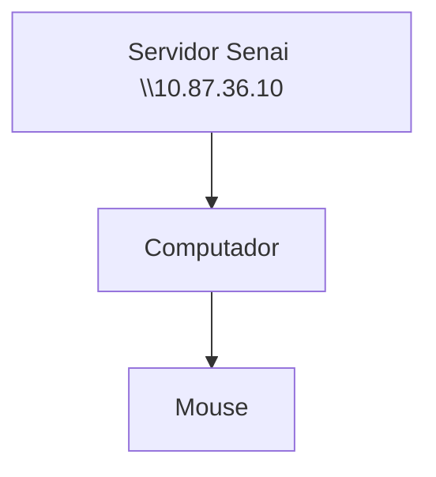
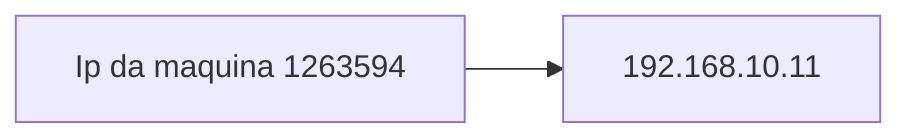
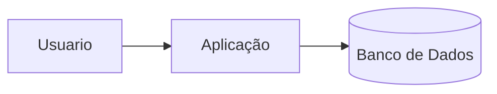
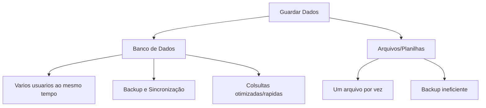

## Configuração do Servidor Educacional


---
**Objetivos**:
- Experiência real de mercado
- Administração de Recusrsos
- Experiência de servidores Linux
---

### Servidor de Arquivos

Servidor educacional para arquivos, mas não dependendo da rede extrernar


---
## Servidor de Desenvolvimento

Cada aluno, recebe o seu proprio acensso

Cada maquiana possui um ip deferente


|Recurso|Configuração|
|-------|------------|
|CPU|2 cores|
|RAM|521 MB|
|DISCO| 6 MB|
|SISTEMA OPERACIONAL| Ubuntu 26.04 LTS|
|ACESSO| SSH (Secure Shell)|


### Comandos no mobaXsterm

|Comando|Funcionalidade|
|---------------------------------------|----|
|password| Mudar senha 
|htop| 

### Dados de Acesso
|Campo|Valor|
|-----|------|
|Ip do conteiner|192.168.10.11|
|Usuario|Root|

## Banco de Dados

Dados: Isolados que não dizem muita coisa

- Ex: Platini, futebol, chuteira

Informação: Dados estruturados

- Ex: O Platini comprou uma chuteira para jogar futebol

Conhecimento: O que podemos extrair à partir das informações

- Ex: Ele precisa comprar uma chuteira para jogar bola

---
### O fluxo normal de um Banco de Dados é mostrado em diferentes situações:



---
> Por qual razão, as empresas não salvam os dados em arquivos?



## SPBD


Primeiro, começamos atualizando os pacotes:
```bash
sudo apt update && upgrade

